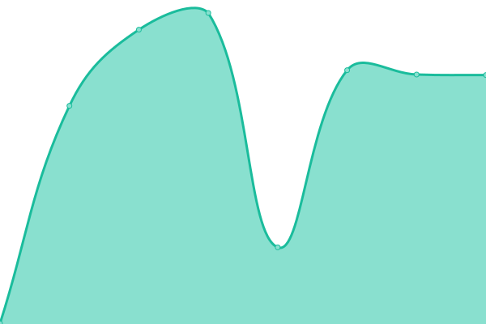
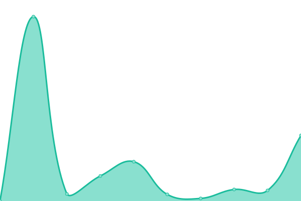
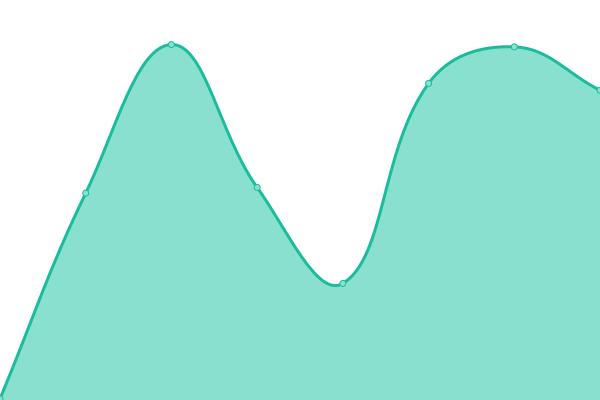

# [📈 Live Status / Statut en direct](https://open-data.github.io/status-statut): <!--live status--> **🟧 Partial outage**

This repository contains the open-source uptime monitor and status page for [Open Government Initiative - Initiative sur le gouvernement ouvert](https://open.canada.ca), powered by [Upptime](https://github.com/upptime/upptime).

With [Upptime](https://upptime.js.org), you can get your own unlimited and free uptime monitor and status page, powered entirely by a GitHub repository. We use [Issues](https://github.com/open-data/status-statut/issues) as incident reports, [Actions](https://github.com/open-data/status-statut/actions) as uptime monitors, and [Pages](https://open-data.github.io/status-statut) for the status page.

## [📈 Live Status](https://demo.upptime.js.org): <!--live status--> **🟧 Partial outage**

<!--start: status pages-->
<!-- This summary is generated by Upptime (https://github.com/upptime/upptime) -->
<!-- Do not edit this manually, your changes will be overwritten -->
<!-- prettier-ignore -->
| URL | Status | History | Response Time | Uptime |
| --- | ------ | ------- | ------------- | ------ |
|  [Portal](https://open.canada.ca) | Up / Opérationnel | [portal.yml](https://github.com/open-data/status-statut/commits/HEAD/history/portal.yml) | 

 187ms
     
 | 

<a href="https://open-data.github.io/status-statut/history/portal">100.00%</a>
    

|  [CKAN](https://open.canada.ca/data/en/dataset/2916fad5-ebcc-4c86-b0f3-4f619b29f412) | Up / Opérationnel | [ckan.yml](https://github.com/open-data/status-statut/commits/HEAD/history/ckan.yml) | 

 336ms
     
 | 

<a href="https://open-data.github.io/status-statut/history/ckan">100.00%</a>
    

|  [Open Data Search](https://search.open.canada.ca/opendata) | Up / Opérationnel | [open-data-search.yml](https://github.com/open-data/status-statut/commits/HEAD/history/open-data-search.yml) | 

 698ms
     
 | 

<a href="https://open-data.github.io/status-statut/history/open-data-search">100.00%</a>
    

|  [Contracts Search](https://search.open.canada.ca/contracts/) | Up / Opérationnel | [contracts-search.yml](https://github.com/open-data/status-statut/commits/HEAD/history/contracts-search.yml) | 

 257ms
     
 | 

<a href="https://open-data.github.io/status-statut/history/contracts-search">99.88%</a>
    

|  [Contracts Search details](https://search.open.canada.ca/contracts/record/tbs-sct,Contracts-TBS-Historical-05257) | Up / Opérationnel | [contracts-search-details.yml](https://github.com/open-data/status-statut/commits/HEAD/history/contracts-search-details.yml) | 

 66ms
     
 | 

<a href="https://open-data.github.io/status-statut/history/contracts-search-details">99.60%</a>
    

|  [ATI Search](https://open.canada.ca/en/search/ati) | Down / En panne | [ati-search.yml](https://github.com/open-data/status-statut/commits/HEAD/history/ati-search.yml) | 

 0ms
     
 | 

<a href="https://open-data.github.io/status-statut/history/ati-search">0.00%</a>
    

|  [ATI Search details](https://open.canada.ca/en/search/ati/reference/0c9449bde99814b30ee8e467528b2fac) | Down / En panne | [ati-search-details.yml](https://github.com/open-data/status-statut/commits/HEAD/history/ati-search-details.yml) | 

 0ms
     
 | 

<a href="https://open-data.github.io/status-statut/history/ati-search-details">0.00%</a>
    

|  [CKAN SQL API](https://open.canada.ca/data/en/api/3/action/datastore_search_sql?sql=SELECT%20%27uptime%27) | Down / En panne | [ckan-sql-api.yml](https://github.com/open-data/status-statut/commits/HEAD/history/ckan-sql-api.yml) | 

 289ms
     
 | 

<a href="https://open-data.github.io/status-statut/history/ckan-sql-api">0.00%</a>
    

|  [NGINX Static Files](https://open.canada.ca/GCWeb/assets/sig-blk-en.svg) | Up / Opérationnel | [nginx-static-files.yml](https://github.com/open-data/status-statut/commits/HEAD/history/nginx-static-files.yml) | 

 22ms
     
 | 

<a href="https://open-data.github.io/status-statut/history/nginx-static-files">100.00%</a>
    

<!--end: status pages-->

[**Visit our status website →**](https://open-data.github.io/status-statut)

## 📄 License

- Powered by: [Upptime](https://github.com/upptime/upptime)
- Code: [MIT](./LICENSE) © [Open Government Initiative - Initiative sur le gouvernement ouvert](https://open.canada.ca)
- Data in the `./history` directory: [Open Database License](https://opendatacommons.org/licenses/odbl/1-0/)
